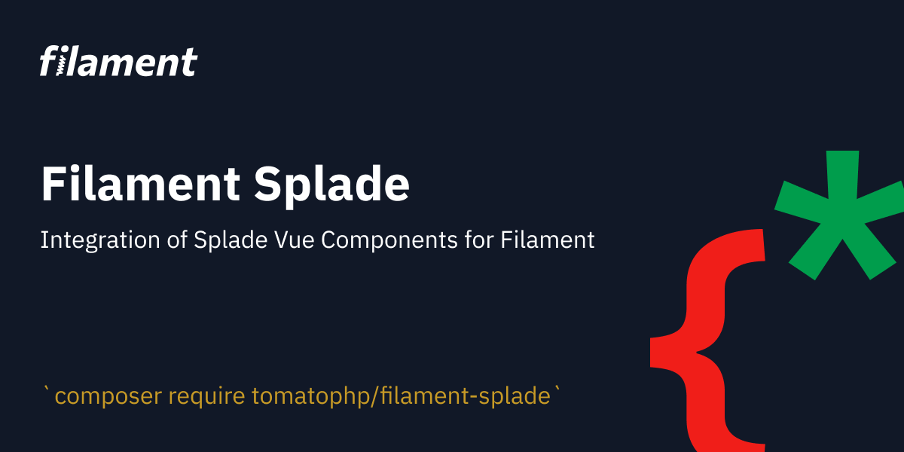
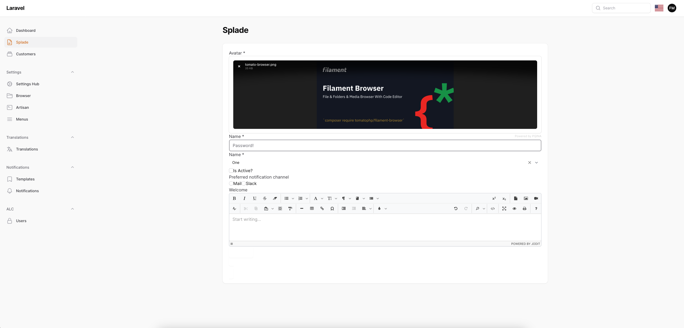
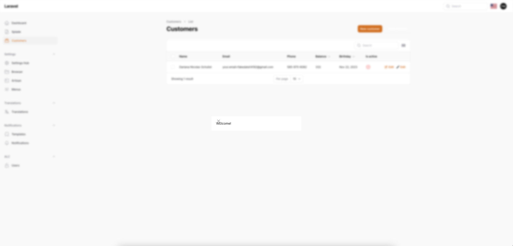
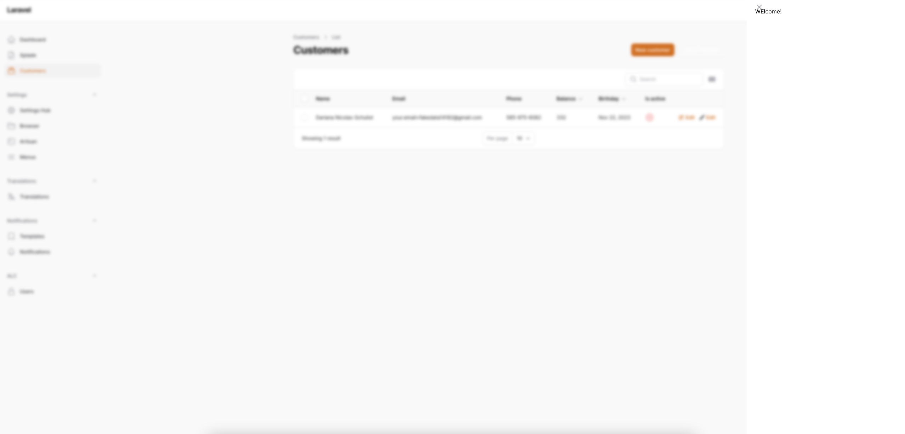
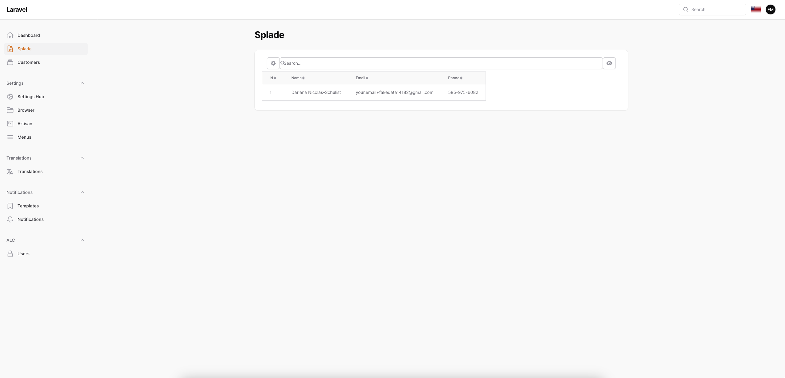

# Filament splade

Integration of [Splade](https://splade.dev/) Vue Components for Filament

**NOTE:**
this project still out of filament style, and we are working to move style to filament for all component and merge the component to the Form/Table Components.

## Screenshots






## Installation

```bash
composer require tomatophp/filament-splade
```

after install your package please run this command

```bash
php artisan filament-splade:install
```

now you need to build your js assets

```bash
yarn
yarn build
```

## Usage

to make any page or resource interact with splade you just need to use this trait

```php
use TomatoPHP\FilamentSplade\Traits\InteractsWithSplade;
```

now you can use any splade component inside your resource.

if you like to use splade everywhere reigster the plugin on `/app/Providers/Filament/AdminPanelProvider.php`

```php
->plugin(\TomatoPHP\FilamentSplade\FilamentSpladePlugin::make())
```

and make sure that you are `global_allow => true` on the config file.

## Publish Assets

you can publish config file by use this command

```bash
php artisan vendor:publish --tag="filament-splade-config"
```

## Support

you can join our discord server to get support [TomatoPHP](https://discord.gg/Xqmt35Uh)

## Docs

you can check docs of this package on [Docs](https://docs.tomatophp.com/plugins/laravel-package-generator)

## Changelog

Please see [CHANGELOG](CHANGELOG.md) for more information on what has changed recently.

## Security

Please see [SECURITY](SECURITY.md) for more information about security.

## Credits

- [Fady Mondy](mailto:info@3x1.io)

## License

The MIT License (MIT). Please see [License File](LICENSE.md) for more information.
